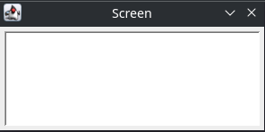

# Advent of Code 2022

My solutions for Advent of Code 2022. This year I am a bit boring, as I am learning Kotlin. I would also like to practice C++ with Abseil and try some SIC/XE assembly if time permits :)

| Day | Nickname               | Kotlin | C++ | SIC/XE                                           |
| --- | ---------------------- | ------ | --- | ------------------------------------------------ |
| 1   | Group by calories      | ✔️     |     |                                                  |
| 2   | Rock Paper Scissors    | ✔️     |     | ✔️                                               |
| 3   | Find common characters | ✔️     |     |                                                  |
| 4   | Overlapping intervals  | ✔️     |     | Candidate                                        |
| 5   | CrateMover 9000        | ✔️     |     | Candidate, pre-parsed, text screen visualization |
| 6   | Find unique substring  | ✔️     |     | Candidate                                        |
| 7   | Bash (ls, cd)          | ✔️     |     |                                                  |
| 8   | Tree heights           | ✔️     |     |                                                  |
| 9   | Rope simulation        | ✔️     |     | Candidate, text screen visualization             |
| 10  | CRT Instructions       | ✔️     |     | ✔️     |
| 11  |                        |        |     |                                                  |
| 12  |                        |        |     |                                                  |
| 13  |                        |        |     |                                                  |
| 14  |                        |        |     |                                                  |
| 15  |                        |        |     |                                                  |
| 16  |                        |        |     |                                                  |
| 17  |                        |        |     |                                                  |
| 18  |                        |        |     |                                                  |
| 19  |                        |        |     |                                                  |
| 20  |                        |        |     |                                                  |
| 21  |                        |        |     |                                                  |
| 22  |                        |        |     |                                                  |
| 23  |                        |        |     |                                                  |
| 24  |                        |        |     |                                                  |
| 25  |                        |        |     |                                                  |

## Script for starting a new day

```bash
./new_day.sh <day_name>
```

## Kotlin

### Running code

Just open the project in IntelliJ and click play on the Day.kt file :)

### Testing code

...TODO? :)

## SIC/XE

### Setup

1. Download `sictools.jar` from https://github.com/jurem/SicTools
2. Move `sictools.jar` to the `sic` directory in this repository.

### Running code

```
java -jar sic/sictools.jar -freq 100000 sic/day-02.sic.asm < inputs/day-02/full.txt
```

## Other language candidates

- Dart to see what it's like and learn Flutter
- Go to see what not caring about code style feels like
- PREV for some torture due to lacking standard library
